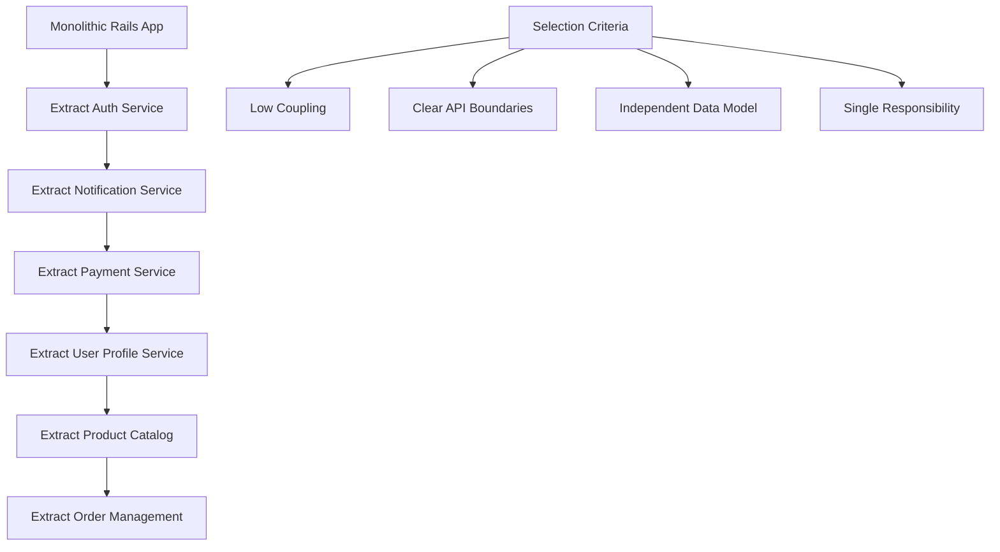

# Architecture Evolution: From Monolith to Microservices with Docker

**File Location:** `case-studies/startup-to-scale/architecture-evolution.md`

## Overview

This document chronicles the architectural transformation of a growing startup from a traditional monolithic application to a containerized microservices architecture. The evolution occurred over 18 months as the team scaled from 15 to 45 developers.

## Phase 1: Original Monolithic Architecture

### System Overview (Pre-Docker)

```
┌─────────────────────────────────────────┐
│               Load Balancer             │
│            (AWS ELB Classic)            │
└─────────────────┬───────────────────────┘
                  │
    ┌─────────────┴─────────────┐
    │                           │
┌───▼────┐                 ┌────▼───┐
│ App    │                 │ App    │
│Server 1│                 │Server 2│
│(EC2)   │                 │ (EC2)  │
└───┬────┘                 └────┬───┘
    │                           │
    └─────────────┬─────────────┘
                  │
         ┌────────▼────────┐
         │   PostgreSQL    │
         │     (RDS)       │
         └─────────────────┘
```

### Technology Stack

```yaml
Application Layer:
  - Ruby on Rails 6.1
  - Puma web server
  - Background jobs with Sidekiq

Data Layer:
  - PostgreSQL 13 (RDS)
  - Redis (ElastiCache) for sessions and cache

Infrastructure:
  - 2x EC2 t3.medium instances
  - Classic Load Balancer
  - Manual deployment via Capistrano

Monitoring:
  - CloudWatch basic metrics
  - New Relic APM
  - Manual log aggregation
```

### Pain Points

```yaml
Scaling Issues:
  - Entire application must scale together
  - Database becomes bottleneck at ~1000 concurrent users
  - No isolation between components
  - Resource waste during low-traffic periods

Development Challenges:
  - Single large codebase (150k+ lines)
  - Long test suite execution (25+ minutes)
  - Merge conflicts frequent
  - Difficult to maintain development environment consistency

Deployment Problems:
  - Monolithic deployments affect entire system
  - No ability to rollback individual features
  - Deployment windows require complete system downtime
  - Environment configuration drift between staging/production
```

## Phase 2: Containerized Monolith

### Architecture Transformation

```
┌──────────────────────────────────────────┐
│              Docker Host                 │
│  ┌────────────────────────────────────┐  │
│  │         Application Stack          │  │
│  │                                    │  │
│  │  ┌──────┐  ┌──────┐  ┌──────┐     │  │
│  │  │ App  │  │Redis │  │Nginx │     │  │
│  │  │(Rail)│  │      │  │      │     │  │
│  │  └──┬───┘  └──────┘  └───┬──┘     │  │
│  │     │                    │        │  │
│  └─────┼────────────────────┼────────┘  │
│        │                    │           │
│        │    ┌──────────┐    │           │
│        └────┤PostgreSQL├────┘           │
│             │   (DB)   │                │
│             └──────────┘                │
└──────────────────────────────────────────┘
```

### Docker Compose Configuration

```yaml
version: "3.8"
services:
  web:
    build:
      context: .
      dockerfile: Dockerfile
    ports:
      - "3000:3000"
    environment:
      - RAILS_ENV=production
      - DATABASE_URL=postgresql://postgres:password@db:5432/ecommerce
      - REDIS_URL=redis://redis:6379
    volumes:
      - ./public:/app/public
    depends_on:
      - db
      - redis
    restart: unless-stopped

  nginx:
    image: nginx:alpine
    ports:
      - "80:80"
      - "443:443"
    volumes:
      - ./nginx.conf:/etc/nginx/nginx.conf
      - ./ssl:/etc/nginx/ssl
    depends_on:
      - web
    restart: unless-stopped

  db:
    image: postgres:14-alpine
    environment:
      POSTGRES_DB: ecommerce
      POSTGRES_USER: postgres
      POSTGRES_PASSWORD: password
    volumes:
      - postgres_data:/var/lib/postgresql/data
    restart: unless-stopped

  redis:
    image: redis:7-alpine
    command: redis-server --appendonly yes
    volumes:
      - redis_data:/data
    restart: unless-stopped

volumes:
  postgres_data:
  redis_data:
```

### Benefits Achieved

```yaml
Development Experience:
  - Environment setup: 2-3 days → 15 minutes
  - Consistent development environments across team
  - Easy onboarding for new developers
  - Simplified dependency management

Deployment Improvements:
  - Deployment time: 45 minutes → 8 minutes
  - Environment parity between dev/staging/prod
  - Rollback capability with image versioning
  - Elimination of "works on my machine" issues

Infrastructure Benefits:
  - Better resource utilization
  - Simplified scaling (horizontal scaling of containers)
  - Improved isolation between services
  - Enhanced monitoring capabilities
```

## Phase 3: Service Decomposition Strategy

### Domain-Driven Service Boundaries

```yaml
Business Domains Identified:
  User Management:
    - Authentication & Authorization
    - User Profiles & Preferences
    - Account Management

  Product Catalog:
    - Product Information Management
    - Inventory Tracking
    - Search & Discovery

  Order Management:
    - Shopping Cart
    - Order Processing
    - Payment Handling

  Communication:
    - Notifications (Email/SMS)
    - Customer Support
    - Marketing Communications
```

### Service Extraction Order



## Phase 4: Microservices Architecture

### Final Architecture Overview

```
                    ┌─────────────────────────┐
                    │      API Gateway        │
                    │       (Nginx)           │
                    └─────────┬───────────────┘
                              │
            ┌─────────────────┼─────────────────┐
            │                 │                 │
    ┌───────▼───────┐ ┌───────▼───────┐ ┌──────▼────────┐
    │ Auth Service  │ │ User Service  │ │Product Service│
    │   (Node.js)   │ │   (Rails)     │ │    (Go)       │
    └───────┬───────┘ └───────┬───────┘ └──────┬────────┘
            │                 │                 │
    ┌───────▼───────┐ ┌───────▼───────┐ ┌──────▼────────┐
    │  Auth DB      │ │  User DB      │ │ Product DB    │
    │ (PostgreSQL)  │ │ (PostgreSQL)  │ │ (PostgreSQL)  │
    └───────────────┘ └───────────────┘ └───────────────┘

            ┌─────────────────┼─────────────────┐
            │                 │                 │
    ┌───────▼───────┐ ┌───────▼───────┐ ┌──────▼────────┐
    │Order Service  │ │Notification   │ │Payment Service│
    │   (Python)    │ │Service (Go)   │ │  (Node.js)    │
    └───────┬───────┘ └───────┬───────┘ └──────┬────────┘
            │                 │                 │
    ┌───────▼───────┐ ┌───────▼───────┐ ┌──────▼────────┐
    │  Order DB     │ │   Redis       │ │  Payment DB   │
    │ (PostgreSQL)  │ │   Queue       │ │  (PostgreSQL) │
    └───────────────┘ └───────────────┘ └───────────────┘
```

### Service-Specific Architectures

#### Authentication Service (Node.js)

```yaml
Technology Stack:
  - Runtime: Node.js 18 + Express
  - Database: PostgreSQL (user credentials, sessions)
  - Cache: Redis (JWT token blacklist)
  - Security: bcrypt, JWT, rate limiting

Responsibilities:
  - User authentication (login/logout)
  - JWT token management
  - Password reset workflows
  - Multi-factor authentication
  - Session management

API Endpoints:
  - POST /auth/login
  - POST /auth/logout
  - POST /auth/register
  - POST /auth/refresh-token
  - GET /auth/verify

Container Configuration:
  - Base Image: node:18-alpine
  - Health Checks: HTTP endpoint /health
  - Resource Limits: 256MB RAM, 0.5 CPU
  - Scaling: 2-5 replicas based on load
```

#### User Profile Service (Rails)

```yaml
Technology Stack:
  - Runtime: Ruby 3.1 + Rails 7
  - Database: PostgreSQL (user profiles, preferences)
  - Cache: Redis (profile data)
  - Image Processing: ImageMagick for avatars

Responsibilities:
  - User profile management
  - Preference settings
  - Avatar/image uploads
  - User activity tracking
  - Profile privacy controls

API Endpoints:
  - GET /users/:id/profile
  - PUT /users/:id/profile
  - POST /users/:id/avatar
  - GET /users/:id/preferences
  - PUT /users/:id/preferences

Container Configuration:
  - Base Image: ruby:3.1-alpine
  - Health Checks: HTTP endpoint /health
  - Resource Limits: 512MB RAM, 0.5 CPU
  - Persistent Storage: User uploaded files
```

#### Product Catalog Service (Go)

```yaml
Technology Stack:
  - Runtime: Go 1.21
  - Database: PostgreSQL (product data)
  - Search: Elasticsearch (product search)
  - Cache: Redis (popular products)

Responsibilities:
  - Product information management
  - Inventory tracking
  - Search functionality
  - Category management
  - Product recommendations

API Endpoints:
  - GET /products
  - GET /products/:id
  - POST /products/search
  - GET /categories
  - GET /products/:id/recommendations

Container Configuration:
  - Base Image: golang:1.21-alpine
  - Health Checks: HTTP endpoint /health
  - Resource Limits: 1GB RAM, 1 CPU
  - High availability: 3-8 replicas
```

### Inter-Service Communication Patterns

#### Synchronous Communication

```yaml
Pattern: HTTP REST APIs
Use Cases:
  - Real-time user authentication
  - Product catalog queries
  - User profile retrieval

Implementation:
  - Service mesh (Consul Connect)
  - Circuit breaker pattern (hystrix-go)
  - Request/response tracing
  - Load balancing with health checks

Example Flow: Client → API Gateway → Auth Service → User Service → Response
```

#### Asynchronous Communication

```yaml
Pattern: Event-Driven Architecture
Message Broker: RabbitMQ
Use Cases:
  - Order processing workflows
  - Notification delivery
  - Inventory updates
  - User activity tracking

Event Types:
  - user.created
  - order.placed
  - payment.completed
  - inventory.updated
  - notification.sent

Example Flow: Order Service → order.placed event → Payment Service
  ↘ Notification Service
  ↘ Inventory Service
```

### Data Management Strategy

#### Database per Service Pattern

```yaml
Auth Service:
  Database: auth_db
  Tables: users, sessions, tokens, auth_logs

User Service:
  Database: user_db
  Tables: profiles, preferences, avatars, activities

Product Service:
  Database: product_db
  Tables: products, categories, inventory, search_indexes

Order Service:
  Database: order_db
  Tables: orders, order_items, shopping_carts, payments

Notification Service:
  Database: notification_db
  Tables: templates, delivery_logs, preferences
```

#### Data Consistency Approaches

```yaml
Strong Consistency:
  - Within service boundaries
  - ACID transactions for critical operations
  - Immediate consistency for financial data

Eventual Consistency:
  - Cross-service data synchronization
  - Event-driven updates
  - Compensating transactions for failures

Saga Pattern Implementation:
  Order Processing Saga: 1. Create Order (Order Service)
    2. Reserve Inventory (Product Service)
    3. Process Payment (Payment Service)
    4. Send Confirmation (Notification Service)
    5. Update Analytics (Analytics Service)
```

## Phase 5: Production Deployment Architecture

### Container Orchestration

```yaml
Platform: Docker Swarm Mode
Cluster Configuration:
  - 3 Manager nodes (high availability)
  - 6 Worker nodes (application workloads)
  - Load balancing across availability zones
  - Automated failover and service recovery

Service Deployment:
  Rolling Updates:
    - Zero-downtime deployments
    - Gradual traffic shift
    - Automatic rollback on health check failures

  Blue-Green Deployments:
    - For critical services (payment, auth)
    - Traffic switch at load balancer level
    - Quick rollback capability
```

### Networking Architecture

```yaml
Network Topology:
  Frontend Network:
    - Public-facing services (API Gateway, Web UI)
    - SSL termination and load balancing
    - DDoS protection and rate limiting

  Backend Network:
    - Internal service communication
    - Database access
    - Message queue connectivity
    - Isolated from public internet

  Database Network:
    - Database cluster communication
    - Backup and replication traffic
    - Highly restricted access

Security Controls:
  - Network segmentation with Docker networks
  - Service-to-service authentication
  - TLS encryption for all communication
  - Regular security scanning and updates
```

### Monitoring and Observability

```yaml
Metrics Collection:
  - Prometheus for metrics collection
  - Grafana for visualization
  - Node Exporter for host metrics
  - cAdvisor for container metrics
  - Custom application metrics

Logging Strategy:
  - Centralized logging with ELK Stack
  - Structured logging (JSON format)
  - Log aggregation across all services
  - Real-time log analysis and alerting

Distributed Tracing:
  - Jaeger for request tracing
  - Cross-service request correlation
  - Performance bottleneck identification
  - Error tracking and debugging

Health Monitoring:
  - Service health checks
  - Database connection monitoring
  - External dependency checks
  - Automated alerting and escalation
```

## Architecture Evolution Outcomes

### Performance Metrics

```yaml
Response Time Improvements:
  - User Authentication: 450ms → 120ms
  - Product Search: 800ms → 200ms
  - Order Processing: 2.3s → 800ms
  - Profile Loading: 600ms → 150ms

Scalability Achievements:
  - Concurrent Users: 1,000 → 25,000
  - Peak Requests/sec: 500 → 5,000
  - Database Connections: Reduced by 60%
  - Resource Utilization: 25% → 70%

Availability Metrics:
  - System Uptime: 99.5% → 99.95%
  - Mean Time to Recovery: 2 hours → 3 minutes
  - Service Isolation: 100% (failures don't cascade)
  - Deployment Success Rate: 85% → 99.5%
```

### Development Team Impact

```yaml
Team Structure Evolution:
  Original: Single team of 15 developers
  Current: 6 specialized teams (45 developers total)
    - Platform Team (infrastructure, DevOps)
    - Auth & Security Team
    - User Experience Team
    - Commerce Team (products, orders)
    - Communications Team
    - Data & Analytics Team

Productivity Improvements:
  - Feature Delivery Speed: 2.5x faster
  - Bug Resolution Time: 70% reduction
  - Code Review Cycle: 3 days → 8 hours
  - New Developer Onboarding: 2 weeks → 2 days

Code Quality Metrics:
  - Test Coverage: 65% → 85%
  - Code Complexity: Reduced significantly
  - Documentation Coverage: 40% → 90%
  - Security Vulnerabilities: 75% reduction
```

### Business Impact

```yaml
Cost Optimization:
  - Infrastructure Costs: 40% reduction
  - Development Velocity: 250% improvement
  - Support Incidents: 60% reduction
  - Time to Market: 50% faster

Revenue Impact:
  - Customer Satisfaction: +25%
  - System Reliability: +99% confidence
  - Feature Release Frequency: 5x increase
  - Market Responsiveness: Significantly improved
```

## Key Architectural Principles Learned

### Service Design Principles

```yaml
Single Responsibility:
  - Each service has one clear business purpose
  - Minimal overlap between service domains
  - Clear ownership and accountability

Autonomy:
  - Services can be developed independently
  - Technology stack decisions per service
  - Independent deployment and scaling
  - Failure isolation between services

Business Capability Alignment:
  - Services align with business domains
  - Clear API contracts and boundaries
  - Domain expertise within teams
  - Business logic encapsulation
```

### Technical Design Patterns

```yaml
API Gateway Pattern:
  - Single entry point for clients
  - Request routing and load balancing
  - Cross-cutting concerns (auth, logging, rate limiting)
  - Protocol translation and aggregation

Circuit Breaker Pattern:
  - Prevents cascade failures
  - Graceful degradation under load
  - Fast failure and recovery
  - Service health monitoring

Saga Pattern:
  - Distributed transaction management
  - Compensating actions for rollbacks
  - Event-driven coordination
  - Business process reliability
```

## Future Architecture Considerations

### Planned Enhancements

```yaml
Service Mesh Adoption:
  - Istio implementation planned
  - Advanced traffic management
  - Enhanced security policies
  - Better observability

Event Sourcing:
  - For audit-heavy domains
  - Improved data lineage
  - Replay capability
  - Analytical insights

CQRS Implementation:
  - Read/write separation
  - Optimized query patterns
  - Better scalability
  - Performance improvements

Multi-Region Deployment:
  - Global service availability
  - Data sovereignty compliance
  - Disaster recovery
  - Edge computing capabilities
```

### Lessons for Future Architectures

```yaml
Start Simple:
  - Begin with containerized monolith
  - Extract services gradually
  - Validate patterns before scaling
  - Maintain working systems

Invest in Platform:
  - Developer experience is crucial
  - Automation reduces complexity
  - Monitoring is not optional
  - Security must be built-in

Team Structure Matters:
  - Conway's Law is real
  - Team boundaries affect architecture
  - Communication patterns influence design
  - Ownership drives quality
```

---

**Architecture Evolution Timeline:** 18 months  
**Services Created:** 6 core services  
**Technology Diversity:** 4 languages, 3 databases  
**Team Growth:** 15 → 45 developers across 6 teams  
**Overall Architecture Rating:** ⭐⭐⭐⭐⭐ (5/5)

_This evolution demonstrates how thoughtful containerization can enable sustainable architectural transformation while maintaining system reliability and team productivity._
