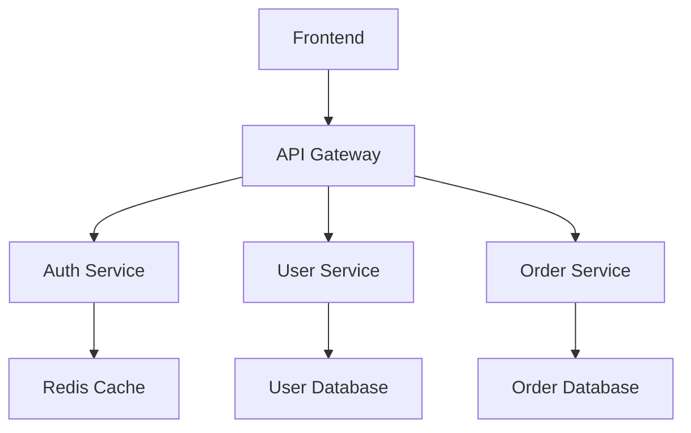

# 08_orchestration/kubernetes-compare/migration-guide.md

# Docker Swarm to Kubernetes Migration Guide

This comprehensive guide walks you through migrating applications from Docker Swarm to Kubernetes.

## Pre-Migration Assessment

### 1. Current State Analysis

**Inventory Checklist:**

```bash
# List all services
docker service ls

# Document service configurations
docker service inspect <service-name>

# Identify dependencies
docker service ls --format "table {{.Name}}\t{{.Ports}}\t{{.Replicas}}"

# Check network configurations
docker network ls

# List secrets and configs
docker secret ls
docker config ls

# Document volume usage
docker volume ls
```

### 2. Application Assessment Matrix

| Component      | Swarm Implementation | K8s Equivalent         | Migration Complexity |
| -------------- | -------------------- | ---------------------- | -------------------- |
| Services       | Docker Services      | Deployments + Services | Medium               |
| Networks       | Overlay Networks     | CNI + Network Policies | Medium               |
| Volumes        | Named Volumes        | Persistent Volumes     | High                 |
| Secrets        | Docker Secrets       | K8s Secrets            | Low                  |
| Configs        | Docker Configs       | ConfigMaps             | Low                  |
| Load Balancing | Ingress Routing      | Ingress Controllers    | Medium               |

### 3. Dependency Mapping

Create a service dependency graph:



## Migration Strategy

### Phase 1: Infrastructure Preparation (Weeks 1-2)

**1. Set up Kubernetes Cluster**

```bash
# Using kubeadm (for on-premises)
kubeadm init --pod-network-cidr=10.244.0.0/16

# Or use managed services
# AWS: eksctl create cluster
# GCP: gcloud container clusters create
# Azure: az aks create
```

**2. Install Essential Tools**

```bash
# kubectl
curl -LO "https://dl.k8s.io/release/$(curl -L -s https://dl.k8s.io/release/stable.txt)/bin/linux/amd64/kubectl"

# Helm
curl https://get.helm.sh/helm-v3.12.0-linux-amd64.tar.gz | tar xz

# Kompose (for initial conversion)
curl -L https://github.com/kubernetes/kompose/releases/download/v1.28.0/kompose-linux-amd64 -o kompose
```

**3. Set up Monitoring and Logging**

```bash
# Prometheus + Grafana
helm repo add prometheus-community https://prometheus-community.github.io/helm-charts
helm install monitoring prometheus-community/kube-prometheus-stack

# ELK Stack
helm repo add elastic https://helm.elastic.co
helm install elasticsearch elastic/elasticsearch
helm install kibana elastic/kibana
```

### Phase 2: Configuration Translation (Weeks 2-3)

**1. Convert Docker Compose to K8s Manifests**

**Original Swarm Configuration:**

```yaml
version: "3.8"
services:
  web:
    image: nginx:alpine
    ports:
      - "80:80"
    deploy:
      replicas: 3
      placement:
        constraints:
          - node.role == worker
    networks:
      - frontend
    configs:
      - nginx_config
```

**Kubernetes Equivalent:**

```yaml
# Deployment
apiVersion: apps/v1
kind: Deployment
metadata:
  name: web
spec:
  replicas: 3
  selector:
    matchLabels:
      app: web
  template:
    metadata:
      labels:
        app: web
    spec:
      containers:
        - name: web
          image: nginx:alpine
          ports:
            - containerPort: 80
          volumeMounts:
            - name: nginx-config
              mountPath: /etc/nginx/nginx.conf
              subPath: nginx.conf
      volumes:
        - name: nginx-config
          configMap:
            name: nginx-config
      nodeSelector:
        node-role.kubernetes.io/worker: "true"
---
# Service
apiVersion: v1
kind: Service
metadata:
  name: web
spec:
  selector:
    app: web
  ports:
    - port: 80
      targetPort: 80
  type: LoadBalancer
---
# ConfigMap
apiVersion: v1
kind: ConfigMap
metadata:
  name: nginx-config
data:
  nginx.conf: |
    # Nginx configuration here
```

**2. Automated Conversion with Kompose**

```bash
# Convert docker-compose.yml to K8s manifests
kompose convert -f docker-compose.yml

# Review and modify generated manifests
ls -la *-deployment.yaml *-service.yaml
```

### Phase 3: Stateless Service Migration (Weeks 3-4)

**Migration Order:**

1. Frontend services (least dependencies)
2. API Gateway
3. Backend services
4. Databases (most critical)

**1. Frontend Service Migration**

**Create Namespace:**

```yaml
apiVersion: v1
kind: Namespace
metadata:
  name: production
```

**Deploy Frontend:**

```bash
# Apply manifests
kubectl apply -f frontend-deployment.yaml
kubectl apply -f frontend-service.yaml
kubectl apply -f frontend-ingress.yaml

# Verify deployment
kubectl get pods -n production
kubectl get services -n production
```

**2. API Gateway Migration**

```yaml
apiVersion: networking.k8s.io/v1
kind: Ingress
metadata:
  name: api-gateway
  annotations:
    nginx.ingress.kubernetes.io/rewrite-target: /
    nginx.ingress.kubernetes.io/cors-allow-origin: "*"
spec:
  rules:
    - host: api.example.com
      http:
        paths:
          - path: /
            pathType: Prefix
            backend:
              service:
                name: api-gateway
                port:
                  number: 80
```

### Phase 4: Stateful Service Migration (Weeks 4-5)

**1. Database Migration Strategy**

**Create Persistent Volume:**

```yaml
apiVersion: v1
kind: PersistentVolume
metadata:
  name: postgres-pv
spec:
  capacity:
    storage: 10Gi
  accessModes:
    - ReadWriteOnce
  persistentVolumeReclaimPolicy: Retain
  storageClassName: local-storage
  local:
    path: /mnt/data
  nodeAffinity:
    required:
      nodeSelectorTerms:
        - matchExpressions:
            - key: kubernetes.io/hostname
              operator: In
              values:
                - node01
```

**Database StatefulSet:**

```yaml
apiVersion: apps/v1
kind: StatefulSet
metadata:
  name: postgres
spec:
  serviceName: postgres
  replicas: 1
  selector:
    matchLabels:
      app: postgres
  template:
    metadata:
      labels:
        app: postgres
    spec:
      containers:
        - name: postgres
          image: postgres:15
          env:
            - name: POSTGRES_DB
              value: appdb
            - name: POSTGRES_USER
              valueFrom:
                secretKeyRef:
                  name: postgres-secret
                  key: username
            - name: POSTGRES_PASSWORD
              valueFrom:
                secretKeyRef:
                  name: postgres-secret
                  key: password
          ports:
            - containerPort: 5432
          volumeMounts:
            - name: postgres-storage
              mountPath: /var/lib/postgresql/data
  volumeClaimTemplates:
    - metadata:
        name: postgres-storage
      spec:
        accessModes: ["ReadWriteOnce"]
        resources:
          requests:
            storage: 10Gi
```

**2. Data Migration Process**

**Backup from Swarm:**

```bash
# Create backup
docker exec $(docker ps -q -f name=postgres) pg_dump -U user appdb > backup.sql

# Copy backup to new location
kubectl cp backup.sql postgres-0:/tmp/backup.sql -n production
```

**Restore to Kubernetes:**

```bash
# Restore data
kubectl exec -it postgres-0 -n production -- psql -U user -d appdb -f /tmp/backup.sql
```

### Phase 5: Traffic Migration (Week 5)

**1. Blue-Green Deployment Strategy**

**Traffic Splitting with Ingress:**

```yaml
apiVersion: networking.k8s.io/v1
kind: Ingress
metadata:
  name: traffic-split
  annotations:
    nginx.ingress.kubernetes.io/canary: "true"
    nginx.ingress.kubernetes.io/canary-weight: "10" # 10% to K8s
spec:
  rules:
    - host: app.example.com
      http:
        paths:
          - path: /
            pathType: Prefix
            backend:
              service:
                name: kubernetes-service
                port:
                  number: 80
```

**2. Gradual Traffic Migration**

**Week 5.1: 10% traffic to K8s**

```bash
kubectl patch ingress traffic-split -p '{"metadata":{"annotations":{"nginx.ingress.kubernetes.io/canary-weight":"10"}}}'
```

**Week 5.2: 50% traffic to K8s**

```bash
kubectl patch ingress traffic-split -p '{"metadata":{"annotations":{"nginx.ingress.kubernetes.io/canary-weight":"50"}}}'
```

**Week 5.3: 100% traffic to K8s**

```bash
kubectl patch ingress traffic-split -p '{"metadata":{"annotations":{"nginx.ingress.kubernetes.io/canary-weight":"100"}}}'
```

## Configuration Translation Examples

### 1. Networks

**Swarm Overlay Network:**

```yaml
networks:
  frontend:
    driver: overlay
    attachable: true
  backend:
    driver: overlay
    driver_opts:
      encrypted: "true"
```

**Kubernetes Network Policy:**

```yaml
apiVersion: networking.k8s.io/v1
kind: NetworkPolicy
metadata:
  name: backend-policy
spec:
  podSelector:
    matchLabels:
      tier: backend
  policyTypes:
    - Ingress
    - Egress
  ingress:
    - from:
        - podSelector:
            matchLabels:
              tier: frontend
  egress:
    - to:
        - podSelector:
            matchLabels:
              tier: database
```

### 2. Secrets and Configs

**Swarm Secret:**

```bash
echo "mypassword" | docker secret create db_password -
```

**Kubernetes Secret:**

```bash
kubectl create secret generic db-password --from-literal=password=mypassword
```

**Swarm Config:**

```bash
docker config create nginx_config nginx.conf
```

**Kubernetes ConfigMap:**

```bash
kubectl create configmap nginx-config --from-file=nginx.conf
```

### 3. Service Discovery

**Swarm Service Discovery:**

- Automatic DNS: `http://service-name:port`
- VIP load balancing

**Kubernetes Service Discovery:**

```yaml
# Service
apiVersion: v1
kind: Service
metadata:
  name: api-service
spec:
  selector:
    app: api
  ports:
    - port: 8080
      targetPort: 8080
  type: ClusterIP # Internal service
```

## Monitoring and Validation

### 1. Pre-Migration Metrics

**Collect Baseline Metrics:**

```bash
# Service performance
docker service ls --format "table {{.Name}}\t{{.Replicas}}"

# Resource usage
docker stats --no-stream

# Response times
curl -w "@curl-format.txt" -o /dev/null -s http://app.example.com/health
```

### 2. Post-Migration Validation

**Health Checks:**

```bash
# Pod health
kubectl get pods -o wide

# Service endpoints
kubectl get endpoints

# Ingress status
kubectl get ingress
```

**Performance Testing:**

```bash
# Load testing with k6
cat <<EOF > load-test.js
import http from 'k6/http';
export default function () {
  http.get('http://app.example.com');
}
EOF

k6 run --vus 10 --duration 30s load-test.js
```

## Troubleshooting Common Issues

### 1. Storage Migration Issues

**Problem:** PV not binding to PVC
**Solution:**

```bash
# Check PV status
kubectl get pv

# Check storage class
kubectl get storageclass

# Manual PV binding
kubectl patch pv pv-name -p '{"spec":{"claimRef":{"name":"pvc-name","namespace":"default"}}}'
```

### 2. Network Connectivity Issues

**Problem:** Services can't communicate
**Solution:**

```bash
# Test DNS resolution
kubectl exec -it pod-name -- nslookup service-name

# Check network policies
kubectl get networkpolicies

# Test connectivity
kubectl exec -it pod-name -- curl service-name:port/health
```

### 3. Configuration Issues

**Problem:** ConfigMaps not mounted
**Solution:**

```bash
# Check ConfigMap
kubectl get configmap config-name -o yaml

# Verify volume mounts
kubectl describe pod pod-name

# Check file permissions
kubectl exec -it pod-name -- ls -la /path/to/config
```

## Rollback Strategy

### Emergency Rollback to Swarm

**1. Traffic Redirect:**

```bash
# Immediate traffic redirect to Swarm
kubectl patch ingress main-ingress -p '{"metadata":{"annotations":{"nginx.ingress.kubernetes.io/canary-weight":"0"}}}'
```

**2. Data Sync Back:**

```bash
# Backup K8s data
kubectl exec postgres-0 -- pg_dump -U user appdb > k8s-backup.sql

# Restore to Swarm
docker exec swarm-postgres psql -U user -d appdb -f k8s-backup.sql
```

## Post-Migration Optimization

### 1. Resource Optimization

**Right-sizing Pods:**

```yaml
resources:
  requests:
    memory: "64Mi"
    cpu: "250m"
  limits:
    memory: "128Mi"
    cpu: "500m"
```

**Horizontal Pod Autoscaling:**

```yaml
apiVersion: autoscaling/v2
kind: HorizontalPodAutoscaler
metadata:
  name: web-hpa
spec:
  scaleTargetRef:
    apiVersion: apps/v1
    kind: Deployment
    name: web
  minReplicas: 3
  maxReplicas: 10
  metrics:
    - type: Resource
      resource:
        name: cpu
        target:
          type: Utilization
          averageUtilization: 70
```

### 2. Security Hardening

**Pod Security Standards:**

```yaml
apiVersion: v1
kind: Namespace
metadata:
  name: production
  labels:
    pod-security.kubernetes.io/enforce: restricted
    pod-security.kubernetes.io/audit: restricted
    pod-security.kubernetes.io/warn: restricted
```

**Service Account and RBAC:**

```yaml
apiVersion: rbac.authorization.k8s.io/v1
kind: Role
metadata:
  name: pod-reader
rules:
  - apiGroups: [""]
    resources: ["pods"]
    verbs: ["get", "watch", "list"]
```

## Success Metrics

### Key Performance Indicators

1. **Availability**: 99.9% uptime maintained
2. **Performance**: <5% latency increase
3. **Scalability**: Auto-scaling functional
4. **Resource Usage**: 20% improvement in utilization
5. **Deployment Speed**: 50% faster deployments
6. **Recovery Time**: <30 seconds for pod failures

### Migration Timeline Summary

| Phase               | Duration | Key Activities         | Success Criteria           |
| ------------------- | -------- | ---------------------- | -------------------------- |
| Assessment          | Week 1   | Inventory and planning | Complete service mapping   |
| Infrastructure      | Week 2   | K8s setup and tooling  | Cluster operational        |
| Translation         | Week 3   | Convert configurations | All manifests ready        |
| Stateless Migration | Week 4   | Deploy services        | All services healthy       |
| Stateful Migration  | Week 5   | Database migration     | Data migrated successfully |
| Traffic Migration   | Week 6   | Gradual traffic shift  | 100% traffic on K8s        |
| Optimization        | Week 7-8 | Performance tuning     | Metrics improved           |

This migration guide provides a structured approach to moving from Docker Swarm to Kubernetes while minimizing downtime and risk.
